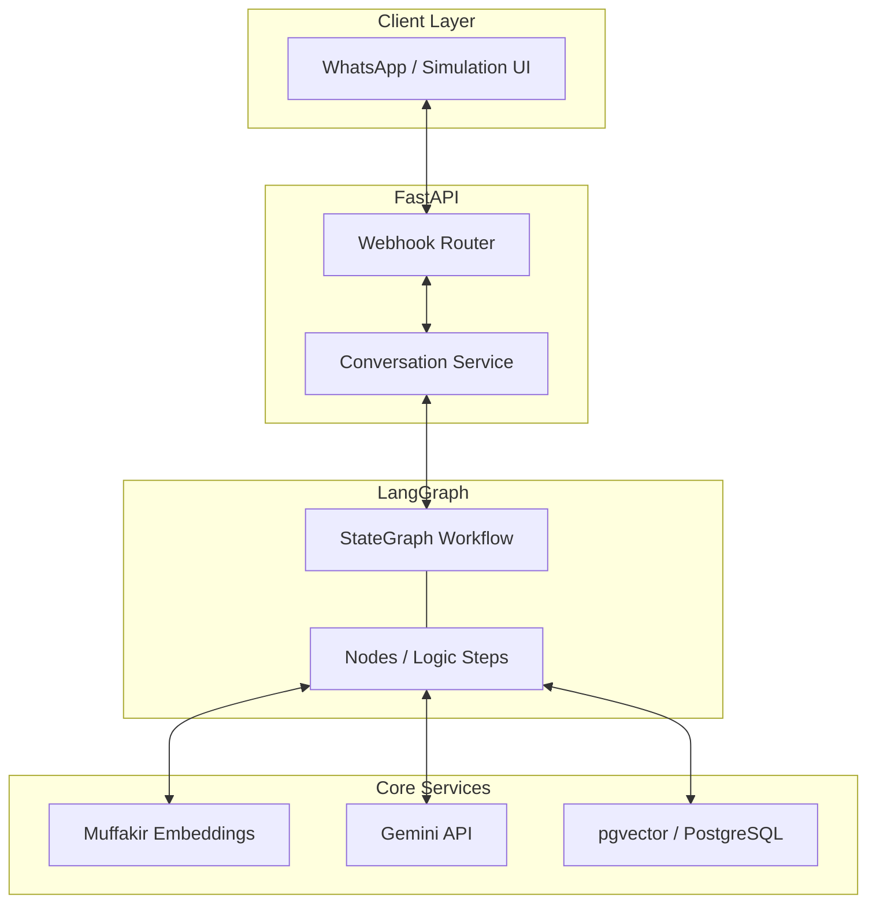
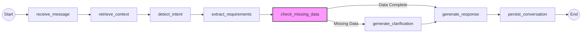

# Customer Chatbot - Architecture & Logic Flow

This document provides a deep dive into the technical architecture, data flow, and conversation orchestration of the Real Estate Customer Chatbot.

## 1. High-Level Architecture

The system follows a modern RAG (Retrieval-Augmented Generation) architecture, using **LangGraph** to manage stateful, multi-step conversations.

---

## 2. Full Logic Flow (The Lifecycle of a Message)

When a customer sends a message, it follows this sequence:

1.  **Ingestion:** The message hits the FastAPI webhook (`/api/webhook` or `/api/webhook/chat`).
2.  **Orchestration:** The `ConversationService` initializes a new `ConversationState` and hands it over to the LangGraph workflow.
3.  **Graph Execution:** The workflow runs through a series of logical "nodes" (steps), updating the state at each step.
4.  **Response:** The final state contains the `response` string generated by the AI, which is then returned to the client and persisted to the database.

---

## 3. LangGraph Workflow Detail

The conversation is modeled as a state machine. Each node is a Python function that performs a specific task and modifies the `ConversationState`.

### 3.1 Node Flow Diagram

### 3.2 Node Responsibilities

| Node | Responsibility | Key Tools Used |
| :--- | :--- | :--- |
| **receive_message** | Entry point; timestamps the message. | - |
| **retrieve_context** | Fetches recent history and similar past messages. | `VectorStore`, `pgvector` |
| **detect_intent** | Categorize message (new search, inquiry, greeting, etc.). | `Gemini LLM` |
| **extract_requirements** | Pulls structured fields (area, budget, etc.) from natural language. | `Gemini LLM` (JSON mode) |
| **check_missing_data** | Validates if the minimum required data is present. | Logic Checks |
| **generate_clarify** | If data is missing, prepares a targeted question. | Logic / LLM |
| **generate_response** | Crafts the final user-facing reply in natural Arabic. | `Gemini LLM` |
| **persist_conversation** | Saves everything (message, response, embedding) to memory. | `pgvector`, `Muffakir` |

---

## 4. Data State (`ConversationState`)

The `ConversationState` is the "brain" of the graph. It is a dictionary that travels between nodes, accumulating information:

- **Input:** `phone_number`, `user_message`
- **Context:** `conversation_history` (recent messages), `retrieved_context` (semantic matches)
- **Intelligence:** `intent`, `extracted_requirements` (structured JSON)
- **Status:** `is_complete` (boolean), `missing_fields` (list)
- **Output:** `response`, `clarification_question`

---

## 5. Core Services Integration

- **Muffakir Embeddings:** Used every time a message is received and every time a response is sent to generate vector embeddings.
- **pgvector (PostgreSQL):** Stores these vectors. Allows the `retrieve_context` node to perform a "Similarity Search" (cosine similarity) to find past relevant context even if the exact words are different.
- **Gemini API:** Acts as the reasoning engine for intent detection, structured data extraction, and natural language generation.

---

## 6. Business Value Logic

The flow ensures that:
1.  **No context is lost:** Every message is compared against historical data.
2.  **Efficiency:** Instead of general chatting, the bot actively tries to "fill the blanks" needed for a real estate request.
3.  **Human-like feel:** Despite the rigid logical structure, Gemini ensures the final Arabic reply is natural and helpful.
